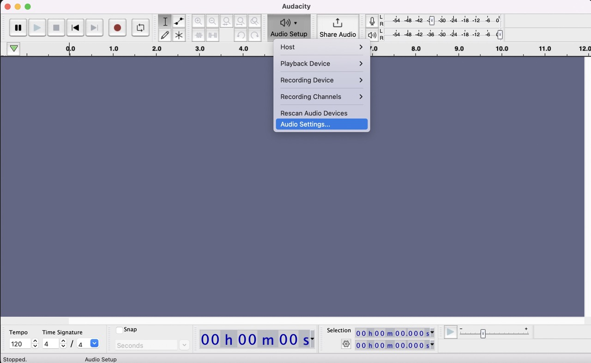

# sd_player
SD card audio player using adafruit feather m0 express, mono 2,5W amp and SPI sd card reader

## How to put new data on the microcontroller

## Mac

### Record audio files using Audacity

1. Download Audacity from https://www.audacityteam.org/download/mac/ and proceed with installation.

1. Start Audacity and change the project sample rate to 8000Hz as shown below

    
    

1. Now you can record audio by pressing record button, it should now automatically record in mono and 8000Hz, you can see that in the metadata of a recorded channel (see below)

    

1. Next you want to export this audio as to put it on one of the buttons so go to `File` in the Top Bar and click `Export Audio`

    

1. When exporting the file make sure that you choose Unsigned 8-bit PCM as Encoding as shown below.

    

1. Now you know how to export an audio file with the correct settings :-)

One note regarding the naming convention, as you can see in the last screenshot above we named the file `btn_weiss.wav`, this is important:
Depending on the name you give it it will end up on one of the buttons, so possible options are `btn_weiss.wav`, `btn_gelb.wav`, `btn_rot.wav` and `btn_blau.wav`.

### How to replace the audio files on the chip

Before you start, you should have recorded all files that you want to replace. You can find the explanation on how to record new files above.

1. Connect a microUSB cable to the chip

    

1. Turn on the soundbox and there will be a new device called `CIRCUITPY` shown in your computer's device tree (or on your desktop). In some cases connecting the soundbox to the computer will pop up the keyboard assistent please press `Quit` and proceed to Finder.

    

2. Now simply drag and drop and **choose Replace files**. The chip only has 2MB of storage so if you don't replace the files but drag them to the Trash you will quickly run out of space:

    

3. Done now press eject on your device tree :-)

# Development

## Breadboard layout

